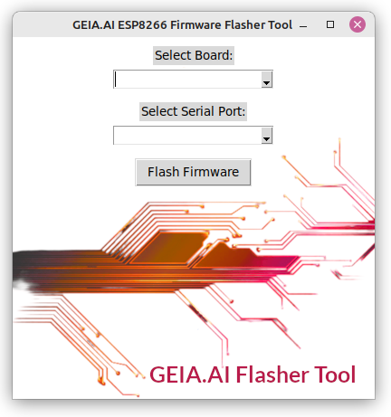

# GEIA.AI Arduino Hydroponics ESP8266/ESP32 Boards Flashing Tool

**Version:** 0.1  

This tool simplifies the process of flashing firmware onto ESP-based boards using the `esptool.py` library (version 4.7.0). It provides a GUI for users to select connected ESP boards, manage firmware files, and initiate flashing without needing to use the command line.

## Screenshot



## About ([GEIA.AI](https://geia.ai/en/))
GEIA.AI is a free automation solution for optimizing indoor farming setups, including hydroponics, aquaponics, aeroponics, high-pressure aeroponics, and automated grow boxes or greenhouses. 
With GEIA.AI, you can automate environmental control, watering schedules, and water quality management, all while reducing plant stress by ensuring a stable, precisely controlled environment. 
Benefit from powerful data analytics presented in charts, or take it further by building personalized control systems and customized charts or insights with our [RestAPI]([https://geia.ai/en/download/]([https://geia.ai/en/partner/extend-geia-ai-rest-api-developers-diy/mqtt-documentation-indoor-farming/](https://geia.ai/partner/extend-geia-ai-rest-api-developers-diy/rest-api-documentation-precisiion-indoor-farming/))) or live data through [MQTT]([https://geia.ai/en/download/](https://geia.ai/en/partner/extend-geia-ai-rest-api-developers-diy/mqtt-documentation-indoor-farming/)).

## ([DIY Arduino Hydroponics Guide for Automated Grow Box](https://geia.ai/en/guides-how-to-set-up-an-automated-grow-system-for-hydroponics-using-arduino-compatible-boards/))
Learn to build an Arduino hydroponics system for an automatic grow box. Our DIY Guide provides detailed steps to flash your GEIA or compatible ESP8266/ESP32 board. Easily attach & Pair nodes, relays and sensors (see our list of supported sensors) to automate everything from indoor grow boxes to greenhouses, creating an ideal environment for your plants to thrive.

## Download compiled version for your OS
Windows, Linux and MacOS
[https://geia.ai/](https://geia.ai/en/download/)

## Prerequisites

Ensure you have the following installed:
- **Python 3.x**
- **esptool.py v4.7.0**
- Required Python libraries: `tkinter`, `serial`, `requests`

1. Clone the repository
2. Install dependencies with:
```bash
pip install esptool pyserial requests
```

## Usage

1. Launch the GUI tool:
```bash
python flash.py
```
2. Connect the Board: Connect your ESP board to your computer via USB.
3. Select COM Port: The tool will list all available ports.
4. Select your board: Select your ESP8266/ESP32 compatible boards.
5. Flash: Click the "Flash" button to begin the flashing process. The progress and any relevant messages will be displayed in the GUI.


## License
This project is licensed under the MIT License. See the LICENSE file for more details.

## Support
For any issues or feature requests, please open an issue on the GitHub repository.
